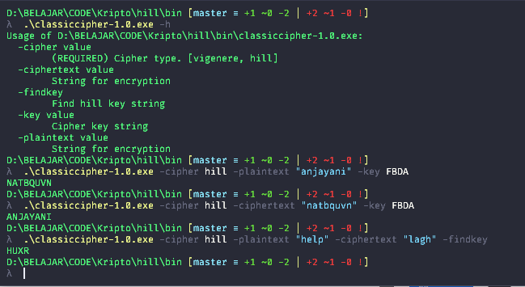

# Classic Cipher

> 140810180008 - Prayudha Adhitia L.
> 140810180074 - Naufal Aulia K.

Simple implementation of classic ciphers, vigenere and hill cipher, using Golang.

## How to Compile

[Get a Golang Compiler](https://golang.org/dl/), if you havent already

Compile code to a binary format

```
go build main.go
```

If you're too lazy to compile the code yourself, binary files for 64 bit Windows and Linux is available on the [Relesases Page](https://github.com/NaufalA/classiccipher/releases)

## How to Use

You can try out this program by running the compiled binary file using these commands

```
-h                
  to show list of available arguments

-cipher="vigenere/hill"
  to select encryption algorithm between Vigenere and Hill cipher

-key="string"
  to provide an ecryption key, e.g. FBDA for 5 1 3 0

-plaintext="string" 
  to provide plain text to be encrypted

-decrypt="string"
  to provide cipher text to be decrypted

-findkey
  to find key using provided plain text and cipher text
```

## Screenshot

Here's a simple screenshot of this program in action

